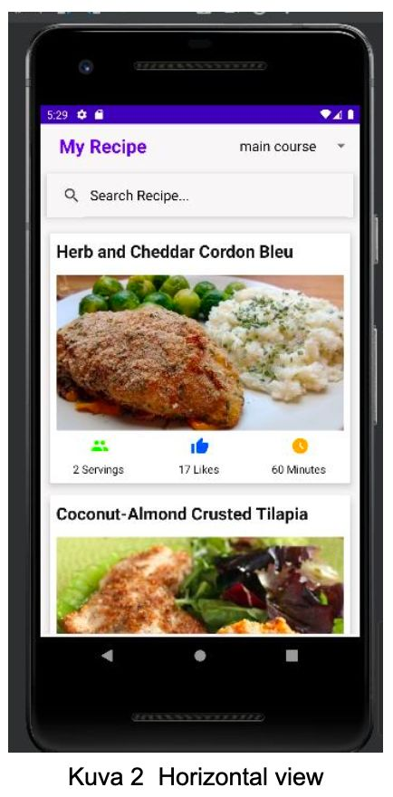
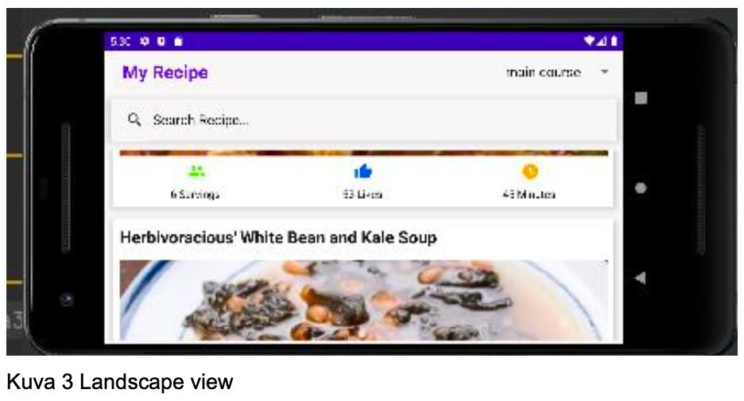
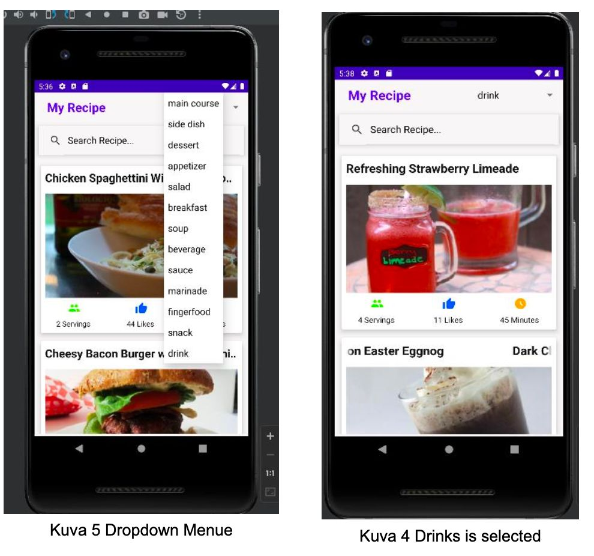
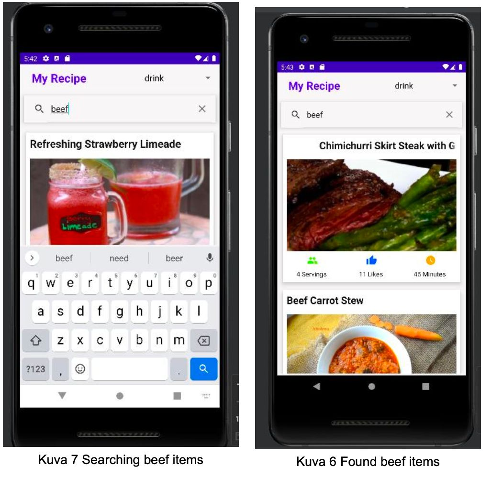
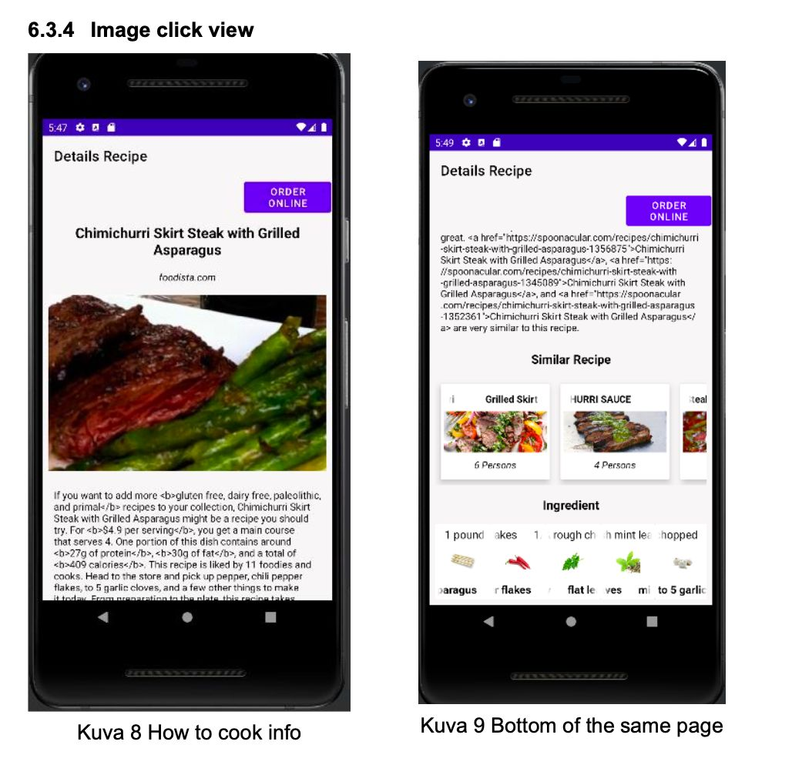
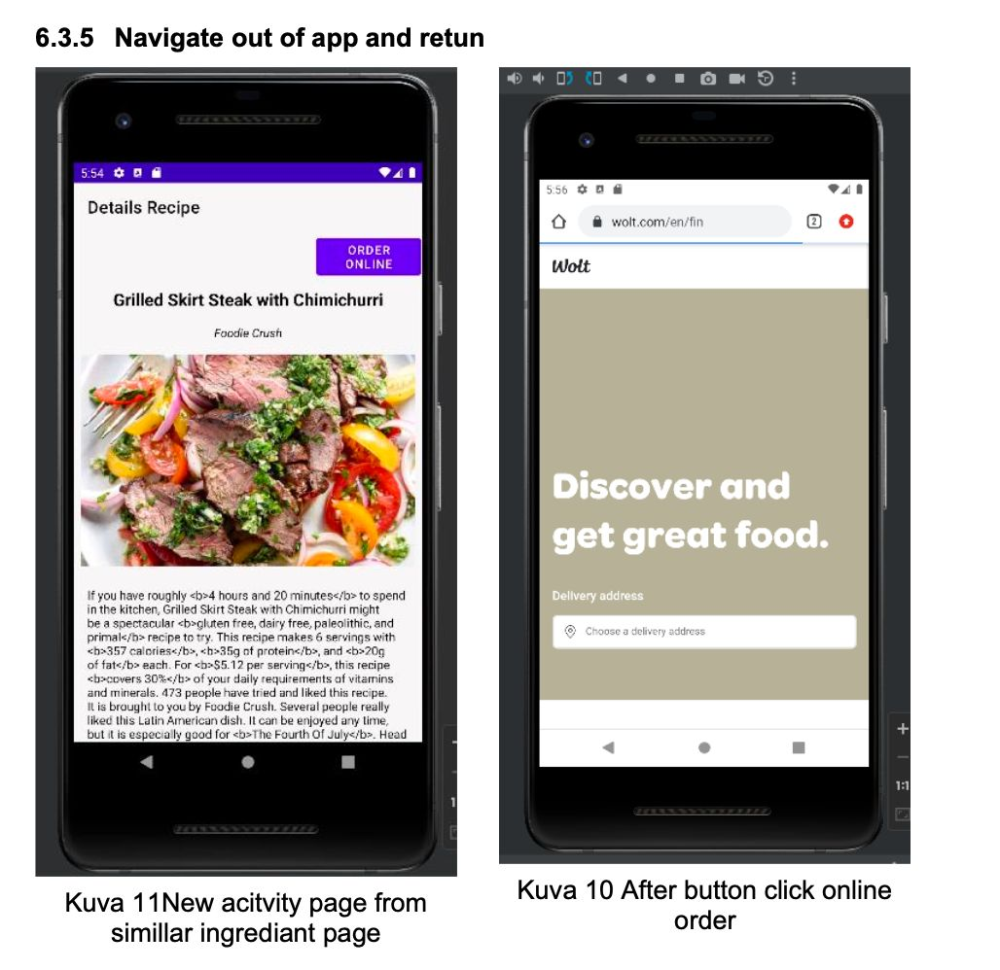

# Recipe App

This Android application allows users to discover random recipes, view recipe details, and find similar recipes. The app integrates with the Spoonacular API to fetch recipe data.

## Features
- Discover random recipes based on tags or search queries.
- View detailed information about a specific recipe, including ingredients and summary.
- Find similar recipes to explore more options.

## Screenshots







## Dependencies
- Retrofit: Used for making API requests.
- Picasso: Used for image loading and caching.

## How to Build and Run

1. **Clone the repository:**
   ```bash
   git clone https://github.com/Razib91lightspeed/Mobile-Dev-1-FinalProject.git
## 1. Open the project in Android Studio.

## 2. Build and run the project on an Android emulator or physical device.

# Usage
## 1. Home Screen:

- **Discover random recipes by selecting tags from the spinner or using the search bar.**
## 2. Recipe Details:

- **Click on a recipe to view detailed information, including ingredients, source, and a summary.**

## 3. Similar Recipes:

- **Scroll horizontally to see similar recipes based on the selected recipe.**
## 4. External Link:

- **Click the "Open Wolt Website" button to open the Wolt website in a web browser.**

# API Key Configuration

To use the Spoonacular API, you need to obtain an API key. Once you have the key, add it to the `api_key` string resource in `res/values/strings.xml`:

```xml
<string name="api_key">YOUR_API_KEY_HERE</string>

## Author
Razib Hasan - GitHub

# Acknowledgments
This project was developed as part of the Mobile Development 1 Final Project.

